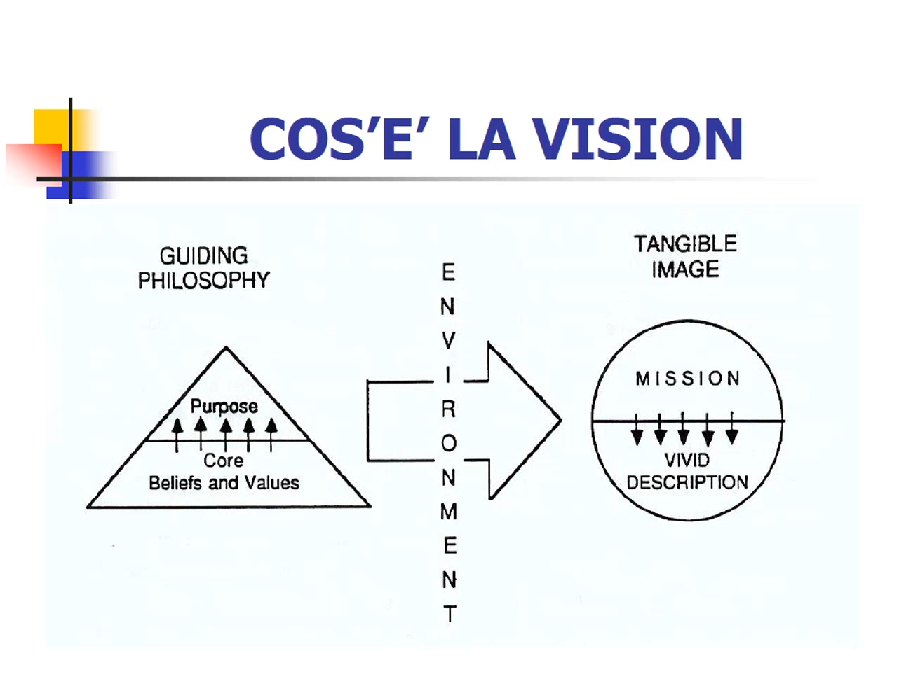

# MIE - 30/09/2020 - 4

Che cos'è la vision aziendale ed a cosa serve? Alla fine avremo solamente delle indicazioni su come si crea una buona vision. Però non ci soffermeremo troppo sul punto dell'implementazione. Che cos'è la vision? Vediamo alcuni esempi di quelli che si chiamano *corporate statement*. Il *corporate* è il livello alto di una multinazionale, la dirigenza. Il corporate statement praticamente è un'affermazione che in poche righe rappresenta l'anima dell'azienda. Adesso ne leggiamo alcuni che dovrebbero essere una sorta di vision. La caratteristica della vision è che non deve toccare solamente la ragione, la testa, ma quando la leggiamo dobbiamo sentire qualcosa nella pancia. Ci deve smuovere le emozioni. Questa sarà la prima ed ultima lezione sullo *human side of management*, poi entreremo tutto nei tecnicismi del management. 

Questa parte è però fondamentale perché qui, attraverso la vision, si crea un'identità dell'organizzazione. Si crea una comunione ed uniformazione dei comportamenti. Si crea una voglia di contribuire alla missione che l'organizzazione formula. Quindi, ha diverse funzioni, ma è quella di fare squadra principalmente. Adesso vediamo il primo esempio di Vision.

> "L'azienda è impegnata a fornire soluzioni ingegneristiche innovative a problemi specialistici in cui la tecnologia e l'attenzione al servizio al cliente possono differenziarla da produzioni standard o artigianali."

Non tocca le corde emotive, uno non si sente mosso.

> "Siamo i migliori nel business. Siamo unici grazie al coinvolgimento dei dipendenti. Promuoviamo lo sviluppo interno senza distinzione di razza, religione, credo o formazione. Solo con l'applicazione, l'orgoglio e l'entusiasmo, i nostri dipendenti e la nostra azienda prosperano. La nostra crescita esplosiva è il risultati di una partnership tra i dipendenti e l'azienda. Ci impegniamo a ricompensare quei dipendenti che 'Make it happen!'"

Questa coinvolge, però è un po caotica. Quello che vedremo oggi è uno schema, un framework, di vision. Questo è uno schema e non necessariamente tutte le vision deevono seguire questo schema, perché poi ogni azienda è libera di interpretare a suo modo la vision. Però questo ci da delle linee guida per formulare la nostra vision in azienda. Ed anche quando noi, se non faremo la nostra startup, andare a vedere le vision disponibili del datore di lavoro o altro. Questo ci permetterà di vedere se siamo allineati e compatibili con quello che l'organizzazione fa. La vision dell'organizzazione ne rappresenta le fondamenta. 

Questo è uno schema ad ombrello. A sinistra abbiamo la *guiding philosophy*, altrimenti detto *core ideology*, che praticamente è la filosofia guida dell'ambiente. In mezzo abbiamo l'ambiente. Significa tutto ciò che è al di fuori dell'impresa, è un termine tecnico del management. A destra abbiamo la *tangible image*, un'immagine tangibile, oppure anche il futuro che vorremmo si realizzasse per la nostra impresa e che cerchiamo di realizzare. Su questo termine un po strano poi ritorneremo. 

Ritornando a sinistra, la *guiding philosophy* è indipendente dall'ambiente. La *tangible image* invece dipende dall'ambiente esterno. La prima, a sua volta, si compone di due componenti. *Core beliefs and values*, il sistema di valori, principi e dogmi dell'azienda (chi siamo noi). Da questo sistema di valori, poi, nasce il *purpose*. Si tratta della ragione di esistere dell'azienda, che ci sta a fare quel business. Queste sono tutte componenti che vanno individuate, formulate, esplicitate e condivise con tutto il personale. Hanno una funzione di creare l'identità, di motivare il personale. Poi c'è l'ambiente esterno. Ci sono i concorrenti, c'è una storia passata, ci sono condizioni al contorno di governo, policy. E quindi da questo, dalla *guiding philosophy*, un po guidata dall'ambiente ma non troppo, si formula quella che è la missione dell'organizzazione e la *vivid description*. Quest'ultima è una formulazione della missione con parole tali che riescono appunto a toccare le emozioni e che riescono a coinvolgere tutto il personale verso la realizzazione di quella missione. Ma chi la fa la vision, chi la formula?

In genere, la vision la formula il fondatore dell'azienda. Non è sempre così, qualche volta c'è una vision ma è nel background e per molti anni le aziende continuano ad operare senza una vision esplicitata. Quindi possono essere persone che sono succedute al fondatore poi a formulare la vision. Oppure può venire anche dal basso, da una parte dell'organizzazione, uno sprono a formulare questa vision. E' fondamentale quando si parla di vision, in genere si identifica una startup con un leader visionario, uno che ha una visione del futuro. Ma è fondamentale che questa vision del leader diventi la vision dell'organizzazione, per cui l'organizzazione continua ad operare anche se il leader viene a mancare.

Adesso entriamo nei singoli componenti di questa vision. Questo è ciò che è affermato Thomas J. Watson, un guru del management. 

> "Io credo profondamente che ogni organizzazione, per durare nel tempo ed avere successo, debba possedere un forte si sistema di valori e principi sui quali fondare tutte le sue politiche ed azioni. Secondo, credo che il determinante fondamentale del successo sia la stretta aderenza a quei principi. E per finire, credo che un'organizzazione nella sua vita debba essere disposta a cambiare tutto di se stessa all'infuori di quei principi."

Avere dei valori significa dimostrarlo con le azioni. Le aziende hanno un comportamento sul mercato, e quel comportamento riflette il sistema di valori dell'azienda. Non deve mai tradire quei principi. Qualche volta potrebbe essere conveniente tradire i propri principi, ma non va mai fatto. Se viene fatto uan volta, viene a cadere tutto il sistema di valori e non c'è più fiducia tra i dipendenti, nel mercato. 

Adesso vediamo alcuni esempi di valori, tratti da alcune grandi aziende americane e non. Ovviamente vanno portate al contesto sia temporale che di cultura del paese. Magari in Italia non ci esprimeremmo in certi termini o in maniera troppo enfatica. I valori possono essere riferiti ad un ventaglio di categorie come i clienti, al personale, al prodotto/servizio. Possono essere riferiti agli azionisti, a diverse categorie.

> "Vendi buoni prodotti a prezzi ragionevoli. Tratta i tuoi clienti come tratteresti i tuoi amici, e vedrai che il business avrà cura di se stesso.", L.L. Bean

> "A tutti i livelli aziendali, quando prendiamo un impegno, scritto o non, lo manteniamo", Bob Miller, CEO di Mips Computer

> "Individua ciò che c'è di buono negli altri e cerca di sviluppare delle qualità", Marriott

> "Ogni membro dell'organizzazione ha la responsabilità di mettere in discussione tutte le decisioni aziendali che non condivide", McKinsey

> "11esimo comandamento: non uccidere mai una nuova idea di prodotto", 3M

> "Noi crediamo nel condurre il mercato con i nostri prodotti, piuttosto che chiedergli che tipo di prodotto vuole", Akio Morita, fondatore Sony

Prima di passare a vedere il *purpose*, riassumiamo.Quando noi formuliamo il sistema di valori, la domanda che dobbiamo porci è la seguente: che valori abbiamo? Non si può fingere. Questo sistema di valori, quando esplicitato, deve smuovere delle emozioni.

Il *purpose* è la ragione di esistere dell'azienda. Quale è la caratteristica nel formulare il purpose? E' continuamente perseguito ma mai raggiunto, visto che il purpose deve durare centinaia di anni. Quello che l'azienda è e che sarà per sempre, non deve essere mai raggiunto. Nella formulazione del purpose bisogna essere molto attenti a questo. Sintetico, conciso, una o due frasi. Non è una descrizione di quello che l'azienda fa oppure è.

> "Siamo lavoratori nell'industria genuinamente ispirati dagli ideali di avanzare la scienza medica e di servire l'umanità", George Merck

> "Dare un contributo al mondo producendo strumenti per la mente che avanzino il genera umano", Steve Jobs

In due parole, il purpose cattura l'anima dell'organizzazione. Abbiamo visto la *guiding philosophy*, ma a questo punto l'azienda deve fare qualcosa. Questa è ancora tutto astratto ma fondamentale. E poi l'azienda si deve confrontare con la realtà. Ed a quel punto, per realizzare il purpose, la sua ragione di esistere, l'azienda si deve dare una missione che in parte dipende anche dall'ambiente. La missione, a differenza del *purpose*, deve avere un tempo ben definito. Io mi pongo degli obiettivi, formulo la missione che deve essere raggiunta in un certo tempo. La mission può essere di quattro tipi.

Può essere di tipo *targeting*, per cui ci si pone degli obiettivi che si cerca di perseguire. Di tipo *common enemy*, andando ad individuare un concorrente che si vuole superare. Può essere di tipo *roll model*, tipica delle startup e delle piccole aziende, che individuano una grande azienda in un settore e puntano ad essere in quel modo. Ed infine abbiamo *internal transformation*, è tipica delle aziende che già operano nel mercato da diversi anni e che vogliono darsi una scossa per trasformarsi. Quale è la caratteristica della missione? Come abbiamo già detto deve essere raggiungibile. A differenza del *purpose* che invece non viene mai raggiunto, può essere raggiunta, ma non deve essere facile. Deve essere formulata in maniere tale da stirare l'organizzazione fino al limite massimo a cui può arrivare. Una buona missione è quella missione per cui la testa dice "Non ce la puoi fare", ma la pancia dice "Si, ce la puoi fare". Quella è una buona missione.

Adesso vediamo alcuni esempi di missioni.

> "Portare un uomo sulla luna e riportarlo sano e salvo sulla terra, prima che questa decade finisca", Presidente Kennedy

> "Raggiungere il punto in cui la sopravvivenza non è più in questione", Start-Up

Un altro aspetto della missione è che quando la missione è stata raggiunta, ce ne deve essere immediatamente un'altra che continui a motivare il personale. Questi due sono di tipo *target*.

> "Beat Coke!! Abbiamo sempre creduto, sin dai primi anni settanta, quando la Pepsi era da tutti riconosciuta come eterna seconda, ceh ce la potevamo fare. Abbiamo formulato quell'obiettivo e non gli abbiamo mai tolto gli occhi di dosso... Ci ha portato ad una missione raggiungi e distruggi contro un Golia", John Sculley, Presidente Pepsi

> "Yamaha wo tsubusu!!!" ("Noi sciacceremo, stritoleremo, faremo a pezzi Yamaha"), Honda

Questo è un tipo di missione *common enemy*.

> "... Essere per l'industria ciclistica quello che Nike è per il settore delle scarpe d'atletica ed Apple per i computer", Jim Gentes, CEO di Giro

> "... Diventare l'Harvard dell'Ovest", Università di Stanford

Questo è un tipo di missione *roll model*.

> "Realizzare una forte sinergia tra la forza della nostra attività di ricerca e la formazione die nostri studenti", Università di Stanford

Questo è un esempio di *internal transformation*.

La *vivid description* è la descrizione della missione in un'immagine tangibile. Creare un qualcosa, un'immagine, che rimane dentro ai lavoratori. Questa è la missione che Henry Ford ha formulato per la sua azienda quando ha creato il famoso modello T.

> "Costruitò un automobile per la massa... Sarà così a buon prezzo che nessun uomo che guadagni un salario decente non possa permettersela... Quando avrò realizzato ciò, il cavallo sparirà dalle strade e l'automobile sarà data per scontata... e daremo ad un gran numero di persone lavoro a buoni stipendi."

> "Oltre alla forza, risorse, e portata di una grande azienda, noi siamo fortemente impegnati a sviluppare la sensibilità, la snellezza, la semplicità e l'agilità di una piccola impresa. Vogliamo il meglio di entrambe", Jack Welch, GE

56.00

Riassumiamo quello che abbiamo detto. Per la vision, le due componenti principali sono la *guiding philosophy*, la filosofia guida (immagine tangibile, sistemi di valori, purpose, missione), e l'immagine tangibile. Deve essere chiara, concisa e comprensibile. Facile da ricordare. Deve essere emozionante, esilerante e motivante. La *guiding philosophy* deve trasmettere un senso di serenità. La missione invece deve essere motivamente e deve spronare. Deve essere sfidante, difficile da raggiungere. Deve essere centrata sull'eccellenza e deve essere perseguibile e tangibile, dunque misurabile. La vision deve essere scritta, perché deve essere comunicata e condivisa. Deve essere rinforzata continuamente con l'esempio. Non è retorica, deve essere dimostrata con le azioni.

A cosa serve? Fornire un'identità. A motivare i dipendenti, a guidare il comportamento e visualizzare il futuro da perseguire. Inoltre, ad indurre coerenza e coordinamento nelle organizzazioni fortemente decentralizzate, con molti business.

> "Un visionary leader vive pochi decenni... Le visionary organization secoli"

E' sufficiente la vision? Forgiare una visionary organization richiede l'1% di vision ed il 99% di allineamento. Solo allora un marziano che cadrà sulla vostra azienda dedurrà la vostra vision senza bisogno di leggerla. Ancorché rappresenti solo l'1%, senza vision non c'è visionary organization.

La vision rappresenta le fondamenta dell'organizzazione. Adesso dobbiamo costruire sull'organizzazione perché poi l'organizzazione deve arrivare alla formulazione del piano strategico. Nelle prossime lezioni comprenderemo il 99% che rimane per creare una visionary organization.  